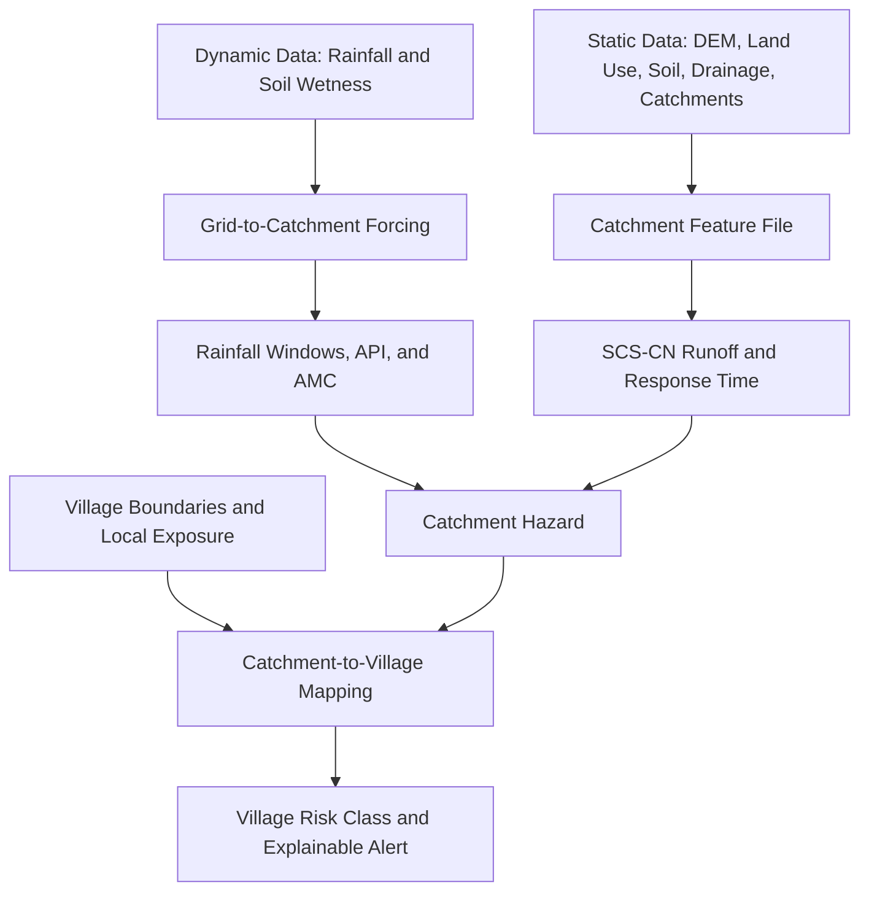

---

## Slide: TECHNICAL APPROACH (Revised — Flash Flood Focus)

**Tentative Technologies to be Used**

*Programming Languages & Frameworks*
- Python (core backend & data science)
- FastAPI + Uvicorn (REST/WebSocket API layer)
- GeoPandas, Shapely, Rasterio, Rasterstats, PyProj, GDAL (geospatial processing)
- Pandas, NumPy, Scikit-learn, XGBoost (ML calibration layer)
- JSON/GeoJSON processed feature files (simple file-backed storage for the pilot)
- React/Next.js + Leaflet or Mapbox GL (dashboard & risk-map frontend)
- MQTT (Paho + local Mosquitto broker) — IoT sensor simulation layer

*Data & APIs*
- Open-Meteo (live rainfall, soil moisture, GloFAS river-discharge/flood API) — no-key prototype/demo source
- NASA GPM IMERG (satellite rainfall), NASA SMAP (soil moisture)
- Bhuvan/SRTM DEM, LGD/Bhuvan village boundaries, CWC/India-WRIS river data, India Flood Inventory

**Methodology & Process for Implementation**

1. **Data Ingestion** – Static layers (DEM, land use, soil, drainage, sub-catchments, village boundaries) + dynamic layers (rainfall, soil moisture, optional river discharge)
2. **Grid-to-Catchment Mapping** – Assign shared coarse weather forcing to hydrological sub-catchments; do not invent village-level rainfall
3. **Catchment Feature Computation**:
   - Rainfall windows (1h/3h/6h/24h), 3/5-day antecedent rain, and Antecedent Precipitation Index
   - Area-weighted land use + soil → Curve Number → SCS-CN runoff depth/volume
   - Flow-path length + channel slope → indicative catchment response time
4. **Village Exposure Mapping** – Map each village to a catchment and adjust catchment hazard using stream proximity and local terrain
5. **Composite Flash-Flood Risk Score** – Weighted fusion of runoff, rainfall-trigger exceedance, antecedent wetness, and village exposure
6. **Optional Calibration** – Historical evidence and Random Forest/XGBoost calibration are enhancements, not baseline dependencies
7. **Alert & Dashboard Layer** – Village-level pilot risk map, explainable factors, and CAP/Sachet-compatible alert output

---

## Slide: FEASIBILITY AND VIABILITY (Revised)

**Analysis of Feasibility**
- Built entirely on **open, publicly accessible data** (Open-Meteo, GPM IMERG, SMAP, Bhuvan, CWC/India-WRIS) — no dependency on restricted-access sources for the prototype
- Uses a **lightweight, explainable physics model** (SCS-CN runoff + antecedent rainfall + terrain-response factor) rather than a heavy deep-learning pipeline — feasible to build, tune, and demo within hackathon timelines
- Proven precedent: coarse-weather + fine-terrain fusion for hydrological hazard forecasting is already operational in South Asia FFGS and used in research (e.g., WRF-based debris-flow/runoff thresholds in Himalayan catchments) — confirms the approach is technically sound
- Modular architecture (FastAPI + compact JSON/GeoJSON files) keeps one pilot valley/district simple; a spatial database is a later scaling option, not an MVP requirement

**Potential Challenges and Risks**
- **Resolution mismatch**: rainfall/soil-moisture grids (4–10 km) are coarser than village boundaries → risk of over-claiming "village-specific" rainfall
- **Sparse/ungauged hill streams**: most flash floods originate in small nalas/streams not covered by CWC gauge stations
- **Limited historical flood event labels** for training and validation (positive-only data, inconsistent geotagging)
- **No guaranteed IMD data access** before demo/production deployment
- **Terrain/runoff parameters** (Curve Number, soil depth) are literature-based defaults, not site-surveyed — introduces model uncertainty
- **False alarms vs missed events** trade-off in threshold tuning
- **Connectivity gaps** in hilly/remote regions affecting live IoT and alert delivery

**Strategies for Overcoming These Challenges**
- Communicate the system as **sub-catchment flash-flood risk mapped to village-level pilot alerts**, not hyperlocal rainfall measurement — sets honest expectations
- Keep historical evidence and presence/pseudo-absence ML calibration optional; the explainable baseline works without them
- Design backend to be **data-source agnostic**: Open-Meteo as a live fallback so the system isn't blocked by IMD approval delays
- Calibrate thresholds using **documented historical flash-flood events** (e.g., Kedarnath 2013, Himachal Pradesh floods) via replay-mode testing before deployment
- Treat **IoT sensors as a correction/enhancement layer**, not a hard dependency — system remains functional with public data alone
- Provide **offline/cached demo mode** to remove live-API dependency risk during demonstrations

---

## Slide: IMPACT AND BENEFITS (Revised)

**Potential Impact on Target Audience**
- Gives **district/panchayat-level disaster management authorities** an early, explainable decision-support layer specifically for flash floods in hilly terrain
- Extends warning coverage to **small, ungauged hill streams and villages** currently outside the scope of CWC's river-gauge-based forecasting
- Uses forecast rainfall and an indicative catchment response time to support earlier preparedness; it does not claim a guaranteed evacuation lead time
- Usable even in villages **without deployed sensors**, unlike sensor-dependent systems — meaningful coverage from day one

**Benefits**

*Social*
- Directly supports **life safety** in flash-flood-prone hill communities
- Builds **community trust** through explainable alerts ("high risk because 24h rainfall is extreme, antecedent wetness is high, and terrain drains rapidly toward the village") rather than opaque black-box warnings
- Supports **CAP/Sachet-compatible alerting**, enabling integration with existing national disaster-alert infrastructure

*Economic*
- Reduces **losses to property, agriculture, and infrastructure** through earlier warning and preparedness
- Lower deployment cost than dense IoT-only networks — **public-data-first design** minimizes upfront hardware investment for district administrations
- Reduces disaster-response and post-event rehabilitation costs through better-targeted preparedness

*Environmental*
- Encourages **data-driven drainage and floodplain awareness**, supporting better long-term planning in flood-prone hill valleys
- Historical-event and terrain layers can inform **sustainable land-use and construction-zoning decisions** near vulnerable streams
- Non-intrusive: relies on satellite/open data, avoiding large-scale physical sensor infrastructure unless locally justified

---

## Slide: RESEARCH AND REFERENCES (Revised)

**Existing Systems Studied**
- South Asia Flash Flood Guidance System (IMD/WMO/Hydrologic Research Center/NOAA/USAID) — https://wmo.int/media/news/south-asia-flash-flood-guidance-system-launched and https://www.hrcwater.org/all-news/hrc-participates-in-the-india-meteorological-department-commissioning-of-flash-flood-guidance-services-for-south-asia/
- CWC Flood Forecasting System — https://ffs.india-water.gov.in/
- India-WRIS / National Water Data Portal — https://indiawris.gov.in/
- AmritaKripa Multi-Hazard Platform (Amrita Center for Wireless Networks & Applications) — covers floods + landslides via dense IoT; referenced for antecedent-rainfall tracking methodology — https://amritakripa.amrita.edu/
- MeghAI — SIH 2025 Cloudburst/Flash-Flood Early Warning System (competitor reference) — https://github.com/atharvakaplay123/MeghAI and https://devpost.com/software/meghai

**Data Sources**
- Bhuvan (ISRO/NRSC) village boundaries & Cartosat DEM — https://bhuvan.nrsc.gov.in/
- Local Government Directory (LGD) village boundaries — https://lgdirectory.gov.in/
- India Geodata open GIS repository (village boundaries, land use, soil, flood inventory, watersheds, rivers) — https://github.com/yashveeeeeeer/india-geodata
- India Flood Inventory (1960s–2020) — Saharia, M., et al. (2021). "India flood inventory." *Natural Hazards*, 108, 619–633.
- NASA GPM IMERG (satellite rainfall, ~0.1°, half-hourly) — https://gpm.nasa.gov/data/imerg
- NASA SMAP Enhanced L3 Soil Moisture (~9 km daily) — https://smap.jpl.nasa.gov/data/
- Open-Meteo (live rainfall, forecast, soil moisture, GloFAS Flood API) — https://open-meteo.com/ and https://open-meteo.com/en/docs/flood-api
- OpenTopography / SRTM DEM — https://opentopography.org/

**Models and Methods**
- SCS Curve Number rainfall–runoff method — USDA NRCS National Engineering Handbook, Part 630, Chapter 10 — https://www.nrcs.usda.gov/resources/guides-and-instructions/national-engineering-handbook-neh
- Terrain-response/slope-drainage rationale (used to justify slope as a runoff-acceleration factor, not a landslide output) — adapted from the same physics used in infinite-slope/TRIGRS models: Baum, R.L., Savage, W.Z., and Godt, J.W. (2008). USGS Open-File Report 2008-1159 — https://pubs.usgs.gov/of/2008/1159/
- Rainfall intensity–duration thresholds for sudden-onset Himalayan events (debris-flow/runoff generation, methodologically relevant to flash-flood nowcasting) — Dixit, S., et al. (2024). *Natural Hazards and Earth System Sciences*, 24, 465–483 — https://nhess.copernicus.org/articles/24/465/2024/

**Other**
- NDMA disaster reports and historical flood event records — https://ndma.gov.in/

---

## Slide: EXISTING SOLUTIONS — COMPARATIVE ANALYSIS (Revised)

| System | Hazard Covered | Spatial Resolution | Lead Time | Core Method | Key Limitation |
|---|---|---|---|---|---|
| **South Asia FFGS** (IMD/WMO/HRC) | Flash floods | Watershed / ~4 km | 6–24 hrs | Hydro-meteorological modeling on gauged watersheds | Not village-level; no local terrain/IoT fusion |
| **CWC / C-FLOOD** | Riverine flooding | River station / select villages | Varies | Gauge-based river forecasting | Covers major rivers only; misses small ungauged hill streams (most flash-flood sources) |
| **AmritaKripa / A-LEWS** (Amrita Univ.) | Landslides + floods | Gram Panchayat | Real-time/hourly | Dense IoT probes + antecedent rainfall | Sensor-dependent — needs physical deployment per region; broader scope than flash floods alone |
| **MeghAI** (SIH 2025 reference) | Cloudbursts/flash floods | Village/district (sensor-dependent) | Real-time | ESP32 sensor mesh + RF/LSTM anomaly detection | No public-data baseline; requires sensor coverage before it can predict anything |
| **Our System** | **Flash floods (focused)** | **Village/ward (terrain-aware)** | **Hours, extendable with antecedent tracking** | **Physics-based (SCS-CN runoff + antecedent rainfall + terrain-response factor) + optional ML calibration + optional IoT** | Uses coarse gridded weather forcing shared across villages — terrain/drainage differentiate risk, not raw rainfall |

**Our Differentiation**
- **Public-data-first**: generates a usable flash-flood risk baseline for every village on day one — no sensor deployment required to start
- **Sharp focus**: dedicated entirely to flash-flood prediction rather than spreading effort across multiple hazards — allows deeper tuning of runoff and antecedent-rainfall logic
- **IoT as enhancement, not dependency**: sensor data (where available) corrects and sharpens the public-data baseline instead of being the sole input
- **Explainable by design**: every risk level is traceable to specific drivers (rainfall window, antecedent wetness, terrain drainage response) — critical for disaster-authority trust and actionability
- **Honest scope**: we do not claim to invent hyperlocal rainfall measurement — our contribution is the *fusion architecture* that makes shared coarse weather data usable at village granularity via terrain-specific runoff response

> *"A lightweight, explainable, public-data-first flash-flood early-warning platform that combines antecedent rainfall, rainfall-runoff estimation, and terrain/drainage response — with optional IoT correction — to prioritize village-level flash-flood preparedness and evacuation lead time."*

---